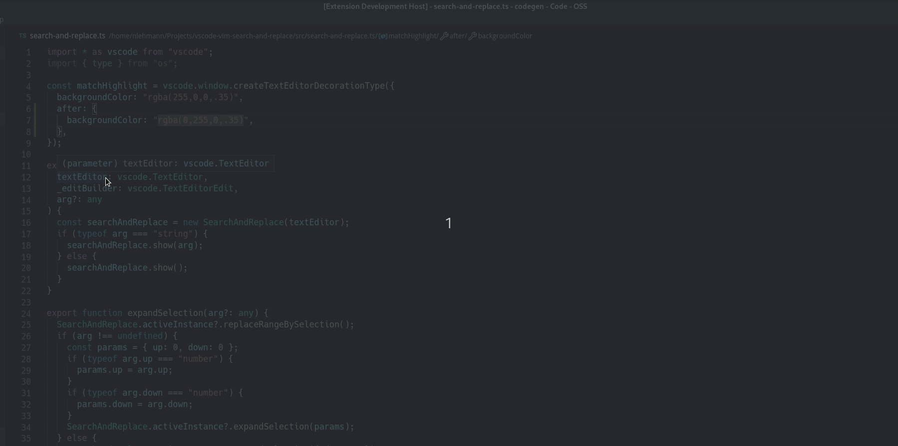

# Vim Search and Replace

Search and replace using vim's `[range]s/search/replace/[flags]` syntax with a nice preview of replacements.



## Quick Start

- Assign a keyboard shortcut to the command `vim-search-and-replace.start`
- Execute the command with the assigned keyboard shortcut and type in the input box after the prompt `%s/`
- You should see matches highlighted in the document. If you type the replacement pattern you should also see a preview of the replacement.

## Features

### Regular expressions

The _search_ string can be any valid javascript regular expressions and _replace_ any valid pattern accepted by [String.prototype.replace](https://developer.mozilla.org/en-US/docs/Web/JavaScript/Reference/Global_Objects/String/replace).

### Flags

- **Global search:** By default the extension find only the first occurrence. Override this behavior using the `g` flag.

  `s/search/replace/g`

- **Multiline search.** The extension search in each line independently unless the `m` flag is specified.

  `s/search/replace/m`

- **Case-insensitive search:** Use the `i` flag for a case-insensitive search.

  `s/search/replace/i`

### Ranges

- Search the entire document

  `%s/search/replace`

- Search the current selection (take a look at `vim-search-and-replace.exandSelection` below)

  `'<,'>s/search/replace`

- Search a specific line range

  `8,10s/search/replace`

### Preview changes

A preview of the replaced string is shown beside each match. Useful when you have a complex regular expression with capture groups used in the replacement pattern.

## Commands

- `vim-search-and-replace.start`: Start the search and replace. This command accepts an optional string parameter which will be used as the initial search string. This is useful in my neovim configuration because I can start the search with the visual selection.

- `vim-search-and-replace.expandSelection`: This command does two things. First, it changes the current range to be `'<,'>`. Second, it expands the current selection to contain more lines. It accepts an optional argument specifying how many lines up and down the selection should be expanded.

  ```
    {
        "key": "ctrl+j",
        "command": "vim-search-and-replace.expandSelection",
        "when": "vim-search-and-replace.active"
        "args": {
            "down": 1
        }
    },
    {
        "key": "ctrl+k",
        "command": "vim-search-and-replace.expandSelection",
        "when": "vim-search-and-replace.active",
        "args": {
            "up": 1
        }
    }
  ```

## Caveats

When setting an initial value to an `InputBox` the whole text gets selected. This is annoying in our case because you want to start typing at the very end.
Currently there's no way to change this behavior (see [this](https://github.com/microsoft/vscode/issues/56759)).
The hack is to set the value after the input box is shown which can cause some delay.
